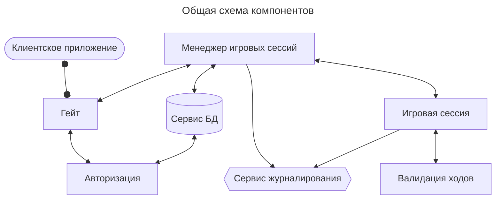

# Архитектура системы
Система предназначена для обеспечения возможности игры двух живых людей через интернет в шахматы.

---

На этой схеме сплошными стрелками показаны доверенные соединения, т.е. такие, в которых получатель уверен, что отправитель — тот, за кого он себя выдаёт, и что сообщение не было подменено по дороге. «Стрелка» с круглыми концами — полнодуплексное синхронное соединение (websocket или аналогичное), обычная стрелка — HTTP.
---

Предлагается разделить всю систему на сервисы:
- Сервис сознания сеанса игры. Обеспечивает создание игровой сессии между 2 игроками. Подготавливает структуру шахматной доски и наборы фигур. Создает первоначальное размещение фигур на доске
- Сервис проверки хода игрока. Проверяет возможно ли совершить ход, который хочет игрок, выбранной фигурой
- Сервис анализа состояния доски.  Анализирует наличие таких моментов как: шах, мат, пат. Так же отвечает за проверку корректности данных.
- Сервис логирования ходов.
- Сервис управления игровыми сессиями. Обеспечивает управление игровыми сессиями. Их выбор по требованию, пауза и завершение
## Сервис создания сеанса
Сервис должен создавать 2 структуры с наборами фигур и одну структуру для хранения состояния доски. Все эти данные помещаются в отдельную структуру с идентификаторами игроков.
## [Сервис проверки хода](validation.md)
На вход получает доску, выбранную фигуру, координаты начального положения фигуры и конечного. Возвращает можно ли сделать такой ход.
Сервис анализа состояния доски
На вход получает игровую сессию. Проводит анализ на наличие игровых ситуаций указанных ранее и возвращает название ситуации и идентификатор игрока, который оказался в этой ситуации.
## Сервис логирования
Ведет логирование всех ходов по игровым сессиям
## Сервис управления игровыми сессиями
Производит управление сессиями: хранение, возобновление. Передает игровые сессии или их данные в другие сервисы.
## Сервис работы с БД
Производит запись, чтение, выборки данных из базы.