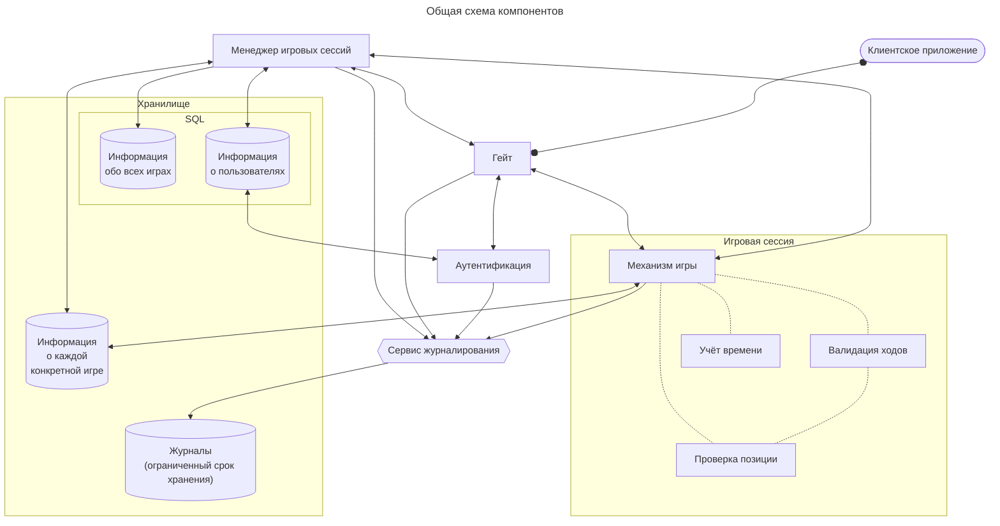

# Архитектура системы
Система предназначена для обеспечения возможности игры двух живых людей через интернет в шахматы.

На этой схеме сплошными стрелками показаны доверенные соединения, т.е. такие, в которых получатель уверен, что отправитель — тот, за кого он себя выдаёт, и что сообщение не было подменено по дороге. «Стрелка» с круглыми концами — полнодуплексное синхронное соединение (websocket или аналогичное), обычная стрелка — HTTP.

---

## Сервис взаимодействия с пользователем («Гейт»)

Проводит аутентификацию пользователя, после чего поддерживает постоянное соединение с пользователем. Направляет (маршрутизирует) полученные от пользователя запросы другим сервисам системы, направляет пользователю информацию (уведомления, ответы) от других компонентов системы.

## Сервис аутентификации

Проверяет, что пользователь, подключившийся к системе через гейт, — тот самый, учётная запись которого есть в системе.

## Сервис управления игровыми сессиями («Менеджер»)

Производит управление сессиями: хранение, возобновление. Передает игровые сессии или их данные в другие сервисы.

## [Сервис игровой сессии](chess_game.md)

Реализует игру в шахматы между двумя игроками.

### [Сервис анализа позиции на доске](board_validation.md)

*Реализован частично.*

Анализирует наличие таких моментов как: шах, мат, пат. Так же отвечает за проверку корректности данных.

## Сервис работы с БД

Производит запись, чтение, выборки данных из базы.

## Сервис журналирования

Ведет логирование всех ходов по игровым сессиям
