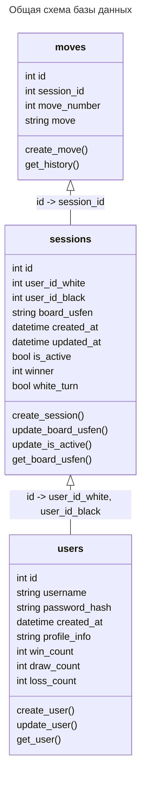

# Сервис базы данных

Сервис отвечает за структуру, а также за добавление, обновление и получение записей из базы данных.

## Требования к API

### 1. Пользователи

#### Таблица users:

| id (int) | username (string) | password_hash (string) ? | created_at (datetime) | profile_info (string) | win_count (int) | draw_count (int) | loss_count (int) |
| -------- |-------------------|--------------------------|-----------------------|----------------------|-----------------|------------------|-------------------|

#### 1.1. Создание пользователя (POST, create_user()):

Метод создает запись о новой игровой сессии в таблице users. Автоматически выставляется время created_at.

##### Входящие параметры:
* username
* password_hash

##### Возвращает:
* Header:
  * `201 Created` - запись создана в БД
  * `403 Forbidden` - данные некорректны, поэтому не записаны в БД
  * `400 Bad Request` - данные корректны, ошибка записи в БД
  * `405 Method Not Allowed` - неправильный метод
* JSON Body:
  * id пользователя

#### 1.2. Обновление информации о пользователе (PUT, update_user()):

Метод изменяет запись пользователя в таблице users, обновляя соответствующие поля.

##### Входящие параметры:
* username
* profile_info

##### Возвращает:
* Header:
  * `200 OK` - данные записаны в БД
  * `403 Forbidden` - данные некорректны, поэтому не записаны в БД
  * `400 Bad Request` - данные корректны, ошибка записи в БД
  * `405 Method Not Allowed` - неправильный метод

#### 1.3. Получить информацию о пользователе (GET, get_user()):

Метод извлекает информацию о пользователе из таблицы users.

##### Входящие параметры:
* username

##### Возвращает:
* Header:
  * `200 OK` - данные извлечены из БД
  * `403 Forbidden` - данные некорректны, поэтому не извлечены из БД
  * `400 Bad Request` - данные корректны, ошибка доступа к БД
  * `405 Method Not Allowed` - неправильный метод
* JSON Body:
  * created_at, profile_info, win_count, draw_count, loss_count

### 2. Игровые сессии

#### Таблица sessions:

| id (int) | user_id_white (int) | user_id_black (int) | board_usfen (string) | creat_at (datetime) | updated_at (datetime) | is_active (bool) | winner (int) | white_turn (bool) |
| -------- | --------------------| ------------------|----------------------|----------------------| ----------------------|------------------|--------------|--------|

#### 2.1. Создание игровой сессии (POST, create_session()):

Метод создает запись о новой игровой сессии в таблице sessions. Автоматически выставляется время created_at, updated_at, winner=None, white_turn=true, is_active=true.

##### Входящие параметры:
* user_id_white
* user_id_black
* board_usfen

##### Возвращает:
* Header:
  * `201 Created` - запись создана в БД
  * `403 Forbidden` - данные некорректны, поэтому не записаны в БД
  * `400 Bad Request` - данные корректны, ошибка записи в БД
  * `405 Method Not Allowed` - неправильный метод
* JSON Body:
  * id игровой сессии

#### 2.2. Обновление (изменение очередности хода) игровой сессии (PUT, update_board_usfen()):

Метод создает изменяет запись игровой сессии по id в таблице sessions. Обновляются поля board_usfen, updated_at, white_turn. При значении outcome != 0, обновляется поле winner и выставляется is_active = false.

##### Входящие параметры:
* id
* board_usfen
* outcome (0 игра в процессе, 1 выигрыш белых, 2 выигрыш черных, 3 ничья)

##### Возвращает:
* Header:
  * `200 OK` - данные записаны в БД
  * `403 Forbidden` - данные некорректны, поэтому не записаны в БД
  * `400 Bad Request` - данные корректны, ошибка записи в БД
  * `405 Method Not Allowed` - неправильный метод

#### 2.3. Обновление статусов игровых сессий (PUT, update_is_active()):

Метод изменяет записи игровых сессии в таблице sessions, присваивая значение is_active = false тем, для которых поле updated_at не удовлетворяет нужному временному интервалу time_limit. Возвращается массив значений id сессий, которые были переведены в статус Неактивно.

##### Входящие параметры:
* time_limit

##### Возвращает:
* Header:
  * `200 OK` - данные записаны в БД
  * `403 Forbidden` - данные некорректны, поэтому не записаны в БД
  * `400 Bad Request` - данные корректны, ошибка записи в БД
  * `405 Method Not Allowed` - неправильный метод
* JSON Body:
  * []id

#### 2.4. Получить позицию на доске для игровой сессии (GET, get_board_usfen()):

Метод извлекает текущую позицию на доске board_usfen для записи игровой сессии с указанным id из таблице sessions.

##### Входящие параметры:
* id

##### Возвращает:
* Header:
  * `200 OK` - данные извлечены из БД
  * `403 Forbidden` - данные некорректны, поэтому не извлечены из БД
  * `400 Bad Request` - данные корректны, ошибка доступа к БД
  * `405 Method Not Allowed` - неправильный метод
* JSON Body:
  * board_usfen

### 3. История ходов

// TODO:
// одна таблица для всей истории vs. отдельная таблица для каждой сессии ?

#### Таблица moves:

| id (int) | session_id (int) ? | move_number (int) | move (string) |
| -------- |--------------------| ------------------|---------------|

#### 3.1. Запись хода в таблицу (POST, create_move()):

Метод создает запись о новом ходе игровой сессии session_id в таблицу moves.
// TODO: подумать, как обыграть отмену ходов.

##### Входящие параметры:
* session_id
* move_number
* move

##### Возвращает:
* Header:
  * `201 Created` - запись создана БД
  * `403 Forbidden` - данные некорректны, поэтому не записаны в БД
  * `400 Bad Request` - данные корректны, ошибка записи в БД
  * `405 Method Not Allowed` - неправильный метод

#### 3.2. Получение полной истории ходов для сессии (GET, get_history()):

Метод извлекает полную историю ходов для игровой сессии session_id из таблицы moves.
// TODO: подумать, как обыграть отмену ходов.

##### Входящие параметры:
* session_id

##### Возвращает:
* Header:
  * `200 OK` - данные извлечены из БД
  * `403 Forbidden` - данные некорректны, поэтому не извлечены из БД
  * `400 Bad Request` - данные корректны, ошибка доступа к БД
  * `405 Method Not Allowed` - неправильный метод
* JSON Body:
  * []move
