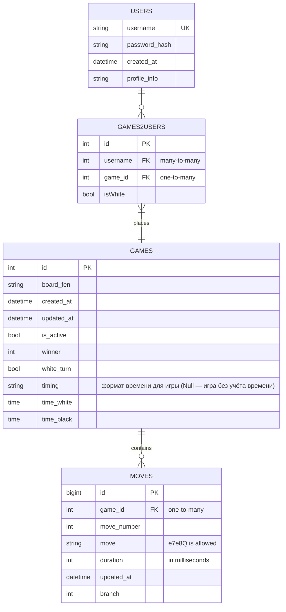

# Сервис базы данных

Сервис отвечает за структуру, а также за добавление, обновление и получение записей из базы данных.
Все входящие параметры (кроме GET-запросов) задаются в виде JSON. Для Get-запросов входящие параметры указаны в url.
Все ответы возвращаются в виде JSON.
Метки времени и интервалы времени передаются в формате ISO8601, UTC с точностью до миллисекунд.

Общая схема базы данных

*Примечание:
Таблицы moves и games обладают служебным, автоматически заполняемым полем updated_at. В случае расхождения информации по позиции на доске из таблицы games и последнего хода из таблицы moves, актуальной для сервиса БД считается информация с более свежим полем updated_at.*

## Требования к API

### 1. Пользователи

#### 1.1. Создание пользователя (POST):

Метод создает запись о новом пользователе в таблице users. Автоматически выставляется время created_at.

##### Входящие параметры:
* username
* password_hash
* profile_info

##### Возвращает:
* Header:
  * `201 Created` - запись создана в БД
  * `405 Method Not Allowed` - неправильный метод
  * `409 Conflict` - пользователь с указанным username уже существует
  * `500 Internal Server Error` - данные корректны, ошибка записи в БД

#### 1.2. Обновление информации о пользователе (PUT):

Метод изменяет запись пользователя в таблице users, обновляя соответствующие поля.

##### Входящие параметры:
* username
* profile_info

##### Возвращает:
* Header:
  * `200 OK` - данные записаны в БД
  * `404 Not Found` - пользователь с указанным username не найден
  * `405 Method Not Allowed` - неправильный метод
  * `500 Internal Server Error` - данные корректны, ошибка записи в БД

#### 1.3. Получить информацию о пользователе (GET):

Метод извлекает информацию о пользователе из таблицы users.

##### Входящие параметры:
* username

##### Возвращает:
* Header:
  * `200 OK` - данные извлечены из БД
  * `404 Not Found` - пользователь с указанным username не найден
  * `405 Method Not Allowed` - неправильный метод
  * `500 Internal Server Error` - данные корректны, ошибка записи в БД
* JSON Body:
  * created_at, profile_info

### 2. Игры

#### 2.1. Создание игры (POST):

Транзакцией создается:
* запись о новой игре в таблице games. Автоматически выставляется время created_at, updated_at, winner=None, is_active=true.
* запись в таблице games2users для игрока белыми
* запись в таблице games2users для игрока черными

##### Входящие параметры:
* user_white
* user_black
* board_fen
* white_turn
* timing
* time_white
* time_black

##### Возвращает:
* Header:
  * `201 Created` - записи созданы в БД
  * `400 Bad Request` - данные некорректны, поэтому не записаны в БД
  * `405 Method Not Allowed` - неправильный метод
  * `500 Internal Server Error` - данные корректны, ошибка записи в БД
* JSON Body:
  * game_id - id игры
  * white_id - id записи в таблице games2users для игрока белыми
  * black_id - id записи в таблице games2users для игрока черными

#### 2.2. Обновление (изменение очередности хода) игры (PATCH):

Метод создает изменяет запись игровой сессии по id в таблице games. Обновляются поля board_fen, updated_at, white_turn. При значении outcome != 0, обновляется поле winner и выставляется is_active = false.

##### Входящие параметры:
* id
* board_fen
* outcome (0 игра в процессе, 1 выигрыш белых, 2 выигрыш черных, 3 ничья)

##### Возвращает:
* Header:
  * `200 OK` - данные записаны в БД
  * `400 Bad Request` - board_fen и/или outcome невалидны, поэтому не записаны в БД
  * `404 Not Found` - игра с id не найдена
  * `405 Method Not Allowed` - неправильный метод
  * `409 Conflict` - попытка установить outcome для игры, где он уже установлен
  * `500 Internal Server Error` - данные корректны, ошибка записи в БД

#### 2.3. Обновление статусов игры (PUT):

Метод изменяет записи игровых сессии в таблице games, присваивая значение is_active = false тем, для которых поле updated_at не удовлетворяет нужному временному интервалу time_limit. Возвращается массив значений id сессий, которые были переведены в статус Неактивно.

##### Входящие параметры:
* time_limit

##### Возвращает:
* Header:
  * `200 OK` - данные записаны в БД
  * `400 Bad Request` - данные некорректны, поэтому не записаны в БД
  * `405 Method Not Allowed` - неправильный метод
  * `500 Internal Server Error` - данные корректны, ошибка записи в БД
* JSON Body:
  * []id

#### 2.4. Получить позицию на доске для игры (GET):

Метод извлекает текущую позицию на доске board_fen для записи игры с указанным id из таблице games.

##### Входящие параметры:
* id

##### Возвращает:
* Header:
  * `200 OK` - данные извлечены из БД
  * `400 Bad Request` - данные некорректны, поэтому не извлечены в БД
  * `404 Not Found` - игра с id не найдена
  * `405 Method Not Allowed` - неправильный метод
  * `500 Internal Server Error` - данные корректны, ошибка доступа в БД
* JSON Body:
  * board_fen, timing, time_white, time_black

### 3. История ходов

#### 3.1. Запись хода в таблицу (POST):

Метод создает запись о новом ходе игры game_id в таблицу moves.

##### Входящие параметры:
* game_id
* move_number
* move
* duration
* updated_at
* branch

##### Возвращает:
* Header:
  * `201 Created` - запись создана БД
  * `400 Bad Request` - данные некорректны, поэтому не записаны в БД
  * `405 Method Not Allowed` - неправильный метод
  * `500 Internal Server Error` - данные корректны, ошибка записи в БД

#### 3.2. Получение полной истории ходов для сессии (GET):

Метод извлекает полную историю ходов для игровой сессии game_id из таблицы moves, для которых branch=0.

##### Входящие параметры:
* game_id

##### Возвращает:
* Header:
  * `200 OK` - данные извлечены из БД
  * `400 Bad Request` - данные некорректны, поэтому не извлечены в БД
  * `405 Method Not Allowed` - неправильный метод
  * `500 Internal Server Error` - данные корректны, ошибка доступа в БД
* JSON Body:
  * []move

#### 3.3. Получение всех ходов игры после move_id (GET):

Метод возвращает все ходы из таблицы moves, следующие после move_id для конкретной игры. Также возвращает номер ветки.

##### Входящие параметры:
* move_id

##### Возвращает:
* Header:
  * `200 OK` - данные поулчены из БД
  * `404 Not Found` - ход с данным move_id не найден
  * `405 Method Not Allowed` - неправильный метод
  * `500 Internal Server Error` - данные корректны, ошибка записи в БД
* JSON BODY:
  * []move_id, branch

#### 3.4. Отмена хода (PUT):

Метод отменяет ходы в таблице moves, присваивая им новое значение branch.

##### Входящие параметры:
* []move_id
* branch

##### Возвращает:
* Header:
  * `201 Created` - запись отредактирована в БД
  * `400 Bad Request` - данные некорректны, поэтому не записаны в БД
  * `405 Method Not Allowed` - неправильный метод
  * `500 Internal Server Error` - данные корректны, ошибка записи в БД
