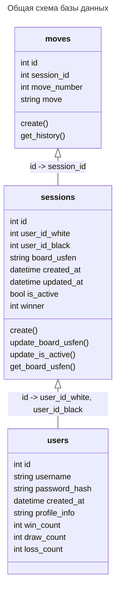

# Сервис базы данных

Сервис отвечает за ...

## Требования к API

### 1. Пользователи TBC

#### Таблица users:

| id (int) | username (string) | password_hash (string) ? | created_at (datetime) | profile_info (string) | win_count (int) | draw_count (int) | loss_count (int) |
| -------- |-------------------|--------------------------|-----------------------|----------------------|-----------------|------------------|-------------------|

### 2. Игровые сессии

#### Таблица sessions:

| id (int) | user_id_white (int) | user_id_black (int) | board_usfen (string) | creat_at (datetime) | updated_at (datetime) | is_active (bool) | winner (int) |
| -------- | --------------------| ------------------|----------------------|----------------------| ----------------------|------------------|--------------|

#### 2.1. Создание игровой сессии:

Метод создает запись о новой игровой сессии в таблице sessions. Автоматически выставляется время created_at, updated_at, winner. Флаг is_active устанавливается true, winner None.

##### Входящие параметры:
* user_id_white
* user_id_black
* board_usfen

##### Возвращает:
* Header:
  * HttpResponse 200 (данные записаны в БД)
  * HttpResponse 403 (данные некорректны, поэтому не записаны в БД)
  * HttpResponse 400 (данные корректны, ошибка записи в БД)
  * HttpResponse 405 (неправильный метод)
* JSON Body:
  * id игровой сессии

#### 2.2. Обновление (изменение очередности хода) игровой сессии:

Метод создает изменяет запись игровой сессии по id в таблице sessions. Обновляются поля board_usfen, updated_at, white_turn. При значении checkmate = true, обновляется поле winner и выставляется is_active = false.

##### Входящие параметры:
* id
* board_usfen
* checkmate

##### Возвращает:
* Header:
  * HttpResponse 200 (данные записаны в БД)
  * HttpResponse 403 (данные некорректны, поэтому не записаны в БД)
  * HttpResponse 400 (данные корректны, ошибка записи в БД)
  * HttpResponse 405 (неправильный метод)

#### 2.3. Обновление статусов игровых сессий:

Метод изменяет записи игровых сессии в таблице sessions, присваивая значение is_active = false тем, для которых поле updated_at не удовлетворяет нужному временному интервалу time-limit. Возвращается массив значений id сессий, которые были переведены в статус Неактивно.

##### Входящие параметры:
* time_limit

##### Возвращает:
* Header:
  * HttpResponse 200 (данные записаны в БД)
  * HttpResponse 403 (данные некорректны, поэтому не записаны в БД)
  * HttpResponse 400 (данные корректны, ошибка записи в БД)
  * HttpResponse 405 (неправильный метод)
* JSON Body:
  * []id

#### 2.4. Получить позицию на доске для игровой сессии:

Метод извлекает позицию на доске board_usfen для записи игровой сессии с указанным id из таблице sessions.

##### Входящие параметры:
* id

##### Возвращает:
* Header:
  * HttpResponse 200 (данные записаны в БД)
  * HttpResponse 403 (данные некорректны, поэтому не записаны в БД)
  * HttpResponse 400 (данные корректны, ошибка записи в БД)
  * HttpResponse 405 (неправильный метод)
* JSON Body:
  * board_usfen

### 3. История ходов

// TODO:
// одна таблица для всей истории vs. отдельная таблица для каждой сессии ?

#### Таблица moves:

| id (int) | session_id (int) ? | move_number (int) | move (string) |
| -------- |--------------------| ------------------|---------------|

#### 3.1. Запись хода в таблицу:

Метод создает запись о новом ходе игровой сессии session_id в таблицу moves.

##### Входящие параметры:
* session_id
* move_number
* move

##### Возвращает:
* Header:
  * HttpResponse 200 (данные записаны в БД)
  * HttpResponse 403 (данные некорректны, поэтому не записаны в БД)
  * HttpResponse 400 (данные корректны, ошибка записи в БД)
  * HttpResponse 405 (неправильный метод)

#### 3.2. Получение полной истории ходов для сессии: tbc 