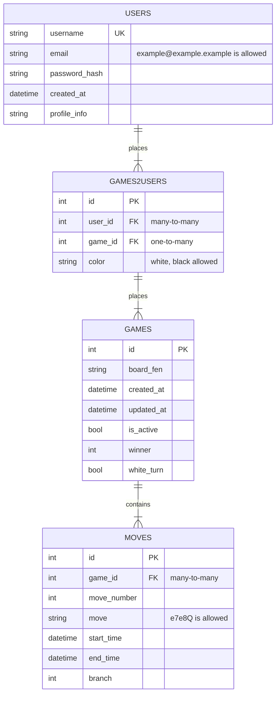
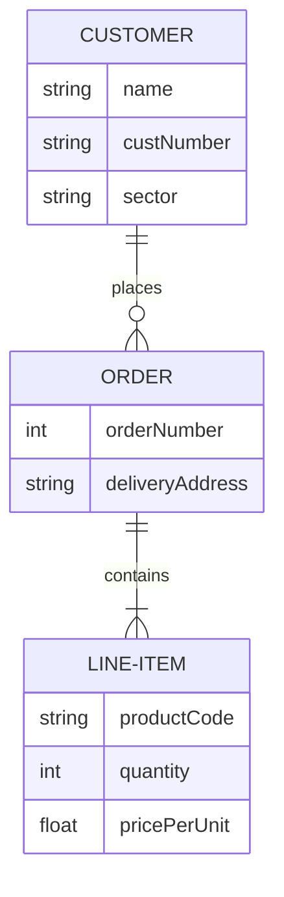

# Сервис базы данных

Сервис отвечает за структуру, а также за добавление, обновление и получение записей из базы данных.

Общая схема базы данных

test

## Требования к API

### 1. Пользователи

#### 1.1. Создание пользователя (POST):

Метод создает запись о новой игровой сессии в таблице users. Автоматически выставляется время created_at.

##### Входящие параметры:
* username
* password_hash
* email
* profile_info

##### Возвращает:
* Header:
  * `201 Created` - запись создана в БД
  * `403 Bad Request` - данные некорректны, поэтому не записаны в БД
  * `405 Method Not Allowed` - неправильный метод
  * `500 Internal Server Error` - данные корректны, ошибка записи в БД

* JSON Body:
  * id пользователя

#### 1.2. Обновление информации о пользователе (PUT):

Метод изменяет запись пользователя в таблице users, обновляя соответствующие поля.

##### Входящие параметры:
* username
* profile_info
* email

##### Возвращает:
* Header:
  * `200 OK` - данные записаны в БД
  * `403 Bad Request` - данные некорректны, поэтому не записаны в БД
  * `405 Method Not Allowed` - неправильный метод
  * `500 Internal Server Error` - данные корректны, ошибка записи в БД

#### 1.3. Получить информацию о пользователе (GET):

Метод извлекает информацию о пользователе из таблицы users.

##### Входящие параметры:
* username

##### Возвращает:
* Header:
  * `200 OK` - данные извлечены из БД
  * `403 Forbidden` - данные некорректны, поэтому не извлечены из БД
  * `400 Bad Request` - данные корректны, ошибка доступа к БД
  * `405 Method Not Allowed` - неправильный метод
* JSON Body:
  * created_at, profile_info, email

### 2. Игры

#### 2.1. Создание игры (POST):

Транзакцией создается:
* запись о новой игре в таблице games. Автоматически выставляется время created_at, updated_at, winner=None, white_turn=true, is_active=true.
* запись в таблице games2users для игрока белыми
* запись в таблице games2users для игрока черными

##### Входящие параметры:
* user_id_white
* user_id_black
* board_fen

##### Возвращает:
* Header:
  * `201 Created` - записи созданы в БД
  * `403 Bad Request` - данные некорректны, поэтому не записаны в БД
  * `405 Method Not Allowed` - неправильный метод
  * `500 Internal Server Error` - данные корректны, ошибка записи в БД
* JSON Body:
  * game_id - id игры
  * white_id - id записи в таблице games2users для игрока белыми
  * black_id - id записи в таблице games2users для игрока черными

#### 2.2. Обновление (изменение очередности хода) игры (PATCH):

Метод создает изменяет запись игровой сессии по id в таблице games. Обновляются поля board_fen, updated_at, white_turn. При значении outcome != 0, обновляется поле winner и выставляется is_active = false.

##### Входящие параметры:
* id
* board_fen
* outcome (0 игра в процессе, 1 выигрыш белых, 2 выигрыш черных, 3 ничья)

##### Возвращает:
* Header:
  * `200 OK` - данные записаны в БД
  * `403 Bad Request` - данные некорректны, поэтому не записаны в БД
  * `405 Method Not Allowed` - неправильный метод
  * `500 Internal Server Error` - данные корректны, ошибка записи в БД

#### 2.3. Обновление статусов игровых сессий (PUT):

Метод изменяет записи игровых сессии в таблице games, присваивая значение is_active = false тем, для которых поле updated_at не удовлетворяет нужному временному интервалу time_limit. Возвращается массив значений id сессий, которые были переведены в статус Неактивно.

##### Входящие параметры:
* time_limit

##### Возвращает:
* Header:
  * `200 OK` - данные записаны в БД
  * `403 Bad Request` - данные некорректны, поэтому не записаны в БД
  * `405 Method Not Allowed` - неправильный метод
  * `500 Internal Server Error` - данные корректны, ошибка записи в БД
* JSON Body:
  * []id

#### 2.4. Получить позицию на доске для игровой сессии (GET):

Метод извлекает текущую позицию на доске board_fen для записи игровой сессии с указанным id из таблице games.

##### Входящие параметры:
* id

##### Возвращает:
* Header:
  * `200 OK` - данные извлечены из БД
  * `403 Bad Request` - данные некорректны, поэтому не извлечены в БД
  * `405 Method Not Allowed` - неправильный метод
  * `500 Internal Server Error` - данные корректны, ошибка доступа в БД
* JSON Body:
  * board_fen

### 3. История ходов

#### 3.1. Запись хода в таблицу (POST):

Метод создает запись о новом ходе игры game_id в таблицу moves.

##### Входящие параметры:
* game_id
* move_number
* move
* start_time
* end_time
* branch

##### Возвращает:
* Header:
  * `201 Created` - запись создана БД
  * `403 Bad Request` - данные некорректны, поэтому не записаны в БД
  * `405 Method Not Allowed` - неправильный метод
  * `500 Internal Server Error` - данные корректны, ошибка записи в БД

#### 3.2. Получение полной истории ходов для сессии (GET):

Метод извлекает полную историю ходов для игровой сессии game_id из таблицы moves.

##### Входящие параметры:
* game_id

##### Возвращает:
* Header:
  * `200 OK` - данные извлечены из БД
  * `403 Bad Request` - данные некорректны, поэтому не извлечены в БД
  * `405 Method Not Allowed` - неправильный метод
  * `500 Internal Server Error` - данные корректны, ошибка доступа в БД
* JSON Body:
  * []move
